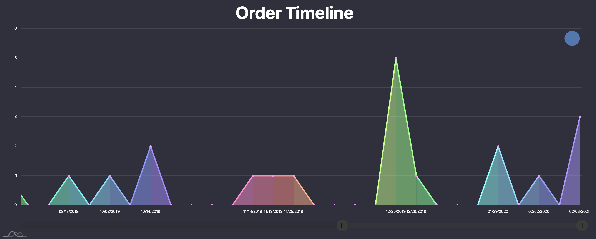
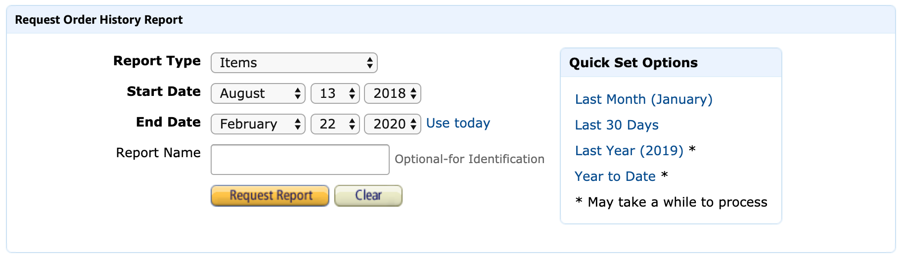

# Amazon Cruncher
If you are a frequent Amazon.com shopper, I believe this program will help you spend your hard-earned money more wisely. you can generate a very detailed order history report on Amazon.com and use this prpgram to help visualizing and analyzing your spending patterns and gain deeper understanding of where your money is going.

## For **Instructions** [scroll down](#how-to-use)

# Example Report
You can crunch your own report on [my website](https://ryanvoigt.github.io/)




# How To Use
## Go To [Amazon Report Download](https://www.amazon.com/gp/b2b/reports?ref_=ya_d_l_order_reports&)


- Choose [Report Type: Items]

- Set report [Start Date] and [End Date] or click on one of the Quick Set options

- Click on [Request Report] and wait for a while - it may take a few minutes before you can download the report

## Open the csv file in [Amazon Cruncher](https://ryanvoigt.github.io/)

## Clone Amazon Cruncher to Your PC

Clone this repo using:
```
git clone git@github.com:RyanVoigt/AmazonCruncher.git
```
And open the folder/navigate to the directory: AmazonCruncher/Cruncher_Display.html


## Contributing
Pull requests are welcome. For major changes, please open an issue first to discuss what you would like to change.

Please make sure to update tests as appropriate.

## Roadmap
Eventually this software will automatically pull in reports using amazon API and send monthly reviews using Twilio  API so you can get consistant updates on your spending habits.
